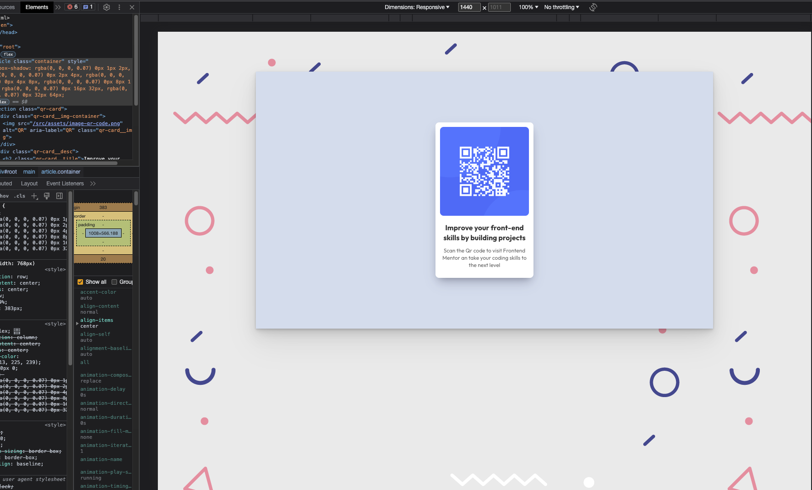
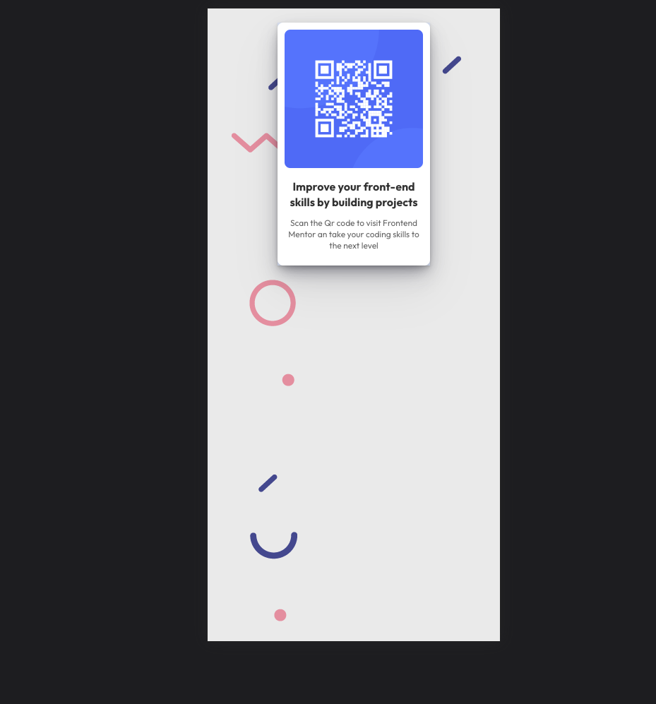

# Make It Real - NAME OF THE PROJECT

This is a solution to the QR code component project of the Make It Real course.

## Table of contents

- [Overview](#overview)
  - [The challenge](#the-challenge)
  - [Screenshot](#screenshot)
- [My process](#my-process)
  - [Built with](#built-with)
  - [What I learned](#what-i-learned)
  - [Continued development](#continued-development)
  - [Useful resources](#useful-resources)
- [Author](#author)
- [Acknowledgments](#acknowledgments)


## Overview

### The challenge

#### Users should be able to:

Build a QR card using BEM notation and React components.

### Screenshot






## My process

### Built with

- Semantic HTML5 markup
- CSS custom properties
- Flexbox
- BEM CSS Notation
- Sass
- React
- React Components

### What I learned

1. I've learned how to layout UIs using flexbox, it's an easy way to set element in the expected place.

```html
<div class="container">
  <h1>This is a centered title</h1>
</div>
```
```css
.container {
  display: flex;
  justify-content: center;
  align-items: center;
}
```

```html
<main class="container">
  <section class="image-container">
    
  </section>
  <section class="message-container">
    <h2 class="not-found-subtitle">
      I have bad news for you
    </h2>
    <p class="not-found-message">
      The page you are looking for might be removed or is temporarily unavailable
    </p>
    <a class="back-to-home__button" href="#">BACK TO HOMEPAGE</a>
  </section>
</main>
```
```css
.container {
  display: flex;
  justify-content: space-between;
  align-items: center;
}
```

```Sass
.profile__container {
    display: flex;
    flex-direction: column;
    height: 200px;
    width: 160px;
    margin-bottom: 20px;

    &:nth-child(even) {
      margin-top: 40px;
    }

    &-name {
      font-weight: bold;
    }

  }
```

2. BEM Notation. It is a front-end naming method for organizing and naming CSS classes. The Block, Element, Modifier methodology is a popular naming convention for class names in HTML and CSS. It helps to write clean CSS by following some simple rules.

```html
<article class="card">
  <section class="card-image-container">
    
  </section>
  <section class="card__title">
    <h2 class="">Andry Peña</h2>
    <section class="card__star">
      <i class="fa-solid fa-star"></i>
      <i class="fa-solid fa-star"></i>
      <i class="fa-regular fa-star"></i>
      <i class="fa-regular fa-star"></i>
      <i class="fa-regular fa-star"></i>
    </section>
  </section>
  <section class="card-text-container">
    <p class="card-text-container__description">
      Global Shaper and Fullstack developer working
      at Zebra Technologies and Somos Networks. I
      love mentoring currently working on Make It
      Real.
    </p>
  </section>
  <section class="card-button-container">
    <button class="card-button-container__button card-button-container__button--transparent">
      Read More
    </button>
    <button class="card-button-container__button">
      Contact
    </button>
  </section>
</article>
```


### Continued development

There are some concept that I would like to learn and to know deeper such as:

- BEM (Naming convention)
- Specificity
- Flexbox
- CSS Grid
- Semantic HTML

### Useful resources

- [CSS Flexbox Course](https://app.ed.team/cursos/flexbox-grid/) - This is a good Flexbox and CSS Grid course.
- [Flexbox Froggy](https://flexboxfroggy.com/#es) - This is a fun game that let you practice Flexbox.

## Author

- LinkedIn - [Andry Peña](https://www.linkedin.com/in/andrystylist/)
- Twitter - [@andrystylist](https://www.twitter.com/andrystylist)